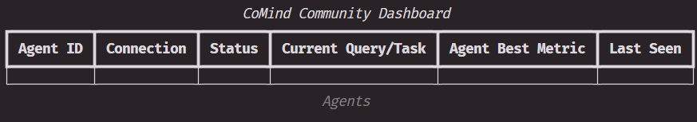

# CoMind: Community-Driven MLE Agent

<div align="center">
    <a href="https://www.python.org/"></a>
    <a href="https://arxiv.org/abs/2506.20640"></a>
    
</div>

CoMind is a community-augmented LLM agent for automated machine learning engineering that leverages collective knowledge from Kaggle-style competitions. CoMind achieves state-of-the-art performance on MLE-Live and outperforms 79.2% of human competitors on average across four ongoing Kaggle competitions.

Inspired by the workflow of human practitioners, CoMind operates in a loop that mirrors how experts read community posts, form new ideas, experiment, and share results. CoMind maintains two central repositories: an idea pool containing abstracted insights derived from community content and prior iterations, and a report pool with finalized solution reports, including code, evaluations, and analyses.

## ✨ Quick Start

### 🎡 Installation

First, clone the repository and navigate to the project directory:
```bash
git clone https://github.com/comind-ml/CoMind.git
cd CoMind
```

Then, build the dependencies and install `comind-community` and `comind-agent` using pip. The `-e` flag installs the project in editable mode.
```bash
pip install -e .
```

To isolate the execution environment, `comind-agent` runs and analyzes the LLM-generated Python code within a 🐳 Docker container. If you plan to use GPUs, you'll need to install the [NVIDIA Container Toolkit](https://docs.nvidia.com/datacenter/cloud-native/container-toolkit/latest/install-guide.html).

Build the Docker container with the following commands:
```bash
cd docker
docker build -t comind-agent .
```

### 🥪 Prepare Datasets

Before running CoMind, you need to download the competition datasets and public resources from Kaggle. The `./competition/download.py` script provides a command-line interface for this purpose. Please ensure you have placed your Kaggle API credentials (`kaggle.json`) in the `~/.kaggle/` directory.

For example, to download all resources for a competition and store them in the `./competitions` directory, run:
```bash
python ./competition/download.py -c <competition-id> --download-dir ./competitions -d -k -t
```

> **Parameters**: 
> - `-c`, `--competition`: The competition ID. You can find this in the URL of the competition's homepage: `https://www.kaggle.com/competitions/<competition-id>`.
> - `-dir`, `--download-dir`: The directory to store the downloaded data. Defaults to `./competitions`.
> - `-e`, `--exclude-after-deadline`: Whether to exclude public discussions/kernels created after the competition's deadline. Defaults to `True`.
> - `-d`, `--dataset`: Flag to download the dataset.
> - `-k`, `--kernels`: Flag to fetch public kernels.
> - `-t`, `--discussions`: Flag to fetch public discussions.
> - `-f`, `--force`: Flag to re-download and overwrite existing data.

After preparation, the target directory will be structured as follows:
```txt
./competitions/<competition-id>
    |- input
        |- train.csv
        |- test.csv
        |- ...
    |- kernels
        |- info.json
        |- 283721122.txt 
        |- ...
    |- discussions
        |- info.json
        |- 2311122.txt
        |- ...
    |- description.md
```

### 🕹️ Running Agents

First, launch the community server. This server manages the exchange of ideas and results.
```bash
comind-community llm.api_key=<your-api-key> community.competition_dir=./competitions/<competition-id>
```

Please wait for the community server to initialize before launching the agents.



Multiple agents can run in parallel to generate solutions and contribute to the community. To launch a single agent, run:
```bash
comind-agent llm.api_key=<your-api-key> input_dir=./competitions/<competition-id>/input
```

For more configuration options, see the [Community Configs](./configs/community/default.yaml) and [Agent Configs](./configs/agent/default.yaml).

## 🎼 License

CoMind is distributed under the MIT License. See [`LICENSE`](./LICENSE) for more details.

## 🪢 Cite

If you use CoMind in your research, please cite our paper:
```
@article{Li2025TowardsCommunityDrivenAgents,
  title        = {Towards Community-Driven Agents for Machine Learning Engineering},
  author       = {Sijie Li and Weiwei Sun and Shanda Li and Ameet Talwalkar and Yiming Yang},
  journal      = {arXiv preprint arXiv:2506.20640},
  year         = {2025},
  month        = jun,
  note         = {arXiv:2506.20640 [cs.AI]},
  url          = {https://arxiv.org/abs/2506.20640}
}
```
